## 06/17/2019 (Monday)

### Killian Weingerger@Cornell
- 3D object detection without expensive lidar (stereo vs lidar)
- Huge performance difference between stereo vs lidar --> but the gap is due to representation of data
- [Pseudo-lidar](https://github.com/patrick-llgc/Learning-Deep-Learning/blob/master/paper_notes/pseudo_lidar.md) (mimic lidar with depth map from mono or stereo)
- You cannot apply conv map on depth map: front depth maps are ill suited for convnets
- Change of representation leads to huge boost
- However depth are inaccurate! Disparity are optimized in the wrong way
	- conv filters on disparity map is a wrong thing, leads to depth bleeding effect
	- for objects that are far away, pixel difference means different things!
	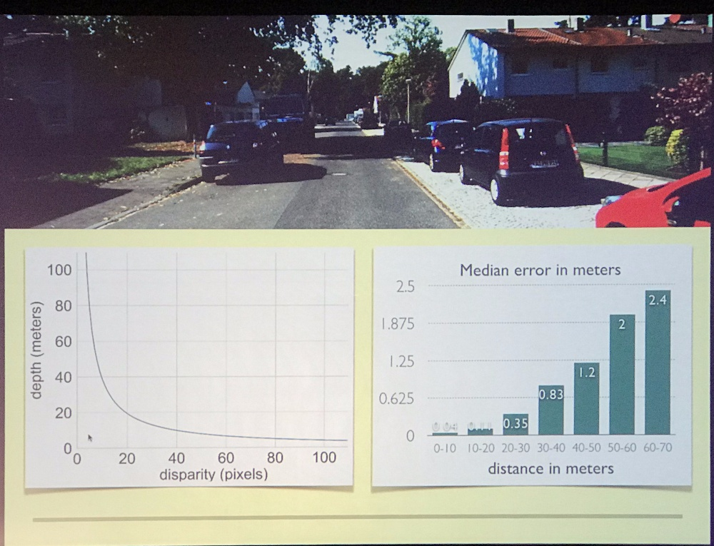
	- Solution: don't estimate disparity, estimate depth!
	- Stereo depth network: optimizes depth cube (in unit of meters)
	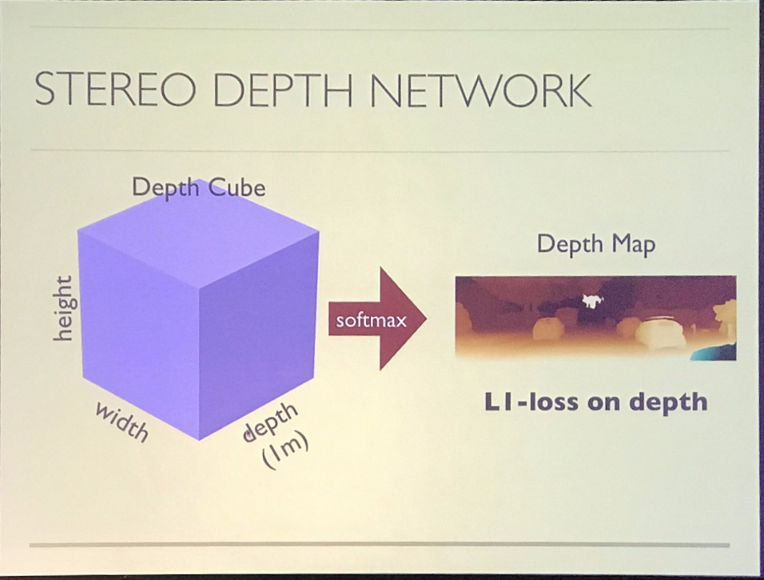
- Use sparse lidar measurement to correct wrong estimation
	- Affinity is correct
	- Correct the whole object (locally linear depth correction)
	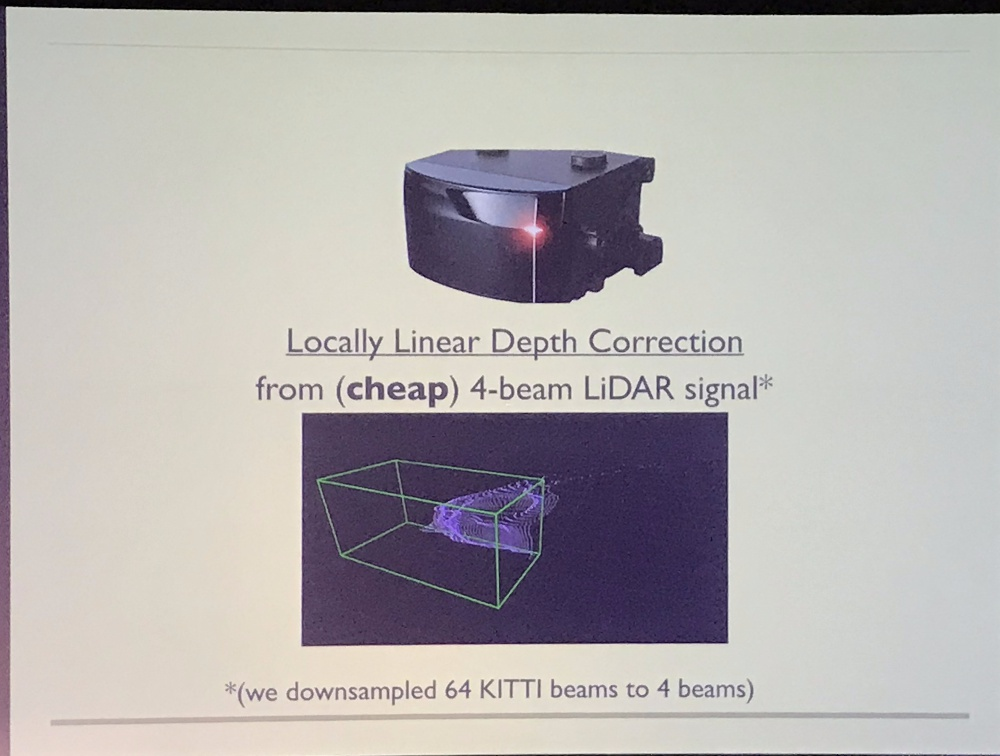
- **Note** [Pseudo lidar++](https://arxiv.org/pdf/1906.06310v1.pdf) uses four-line lidar to correct depth

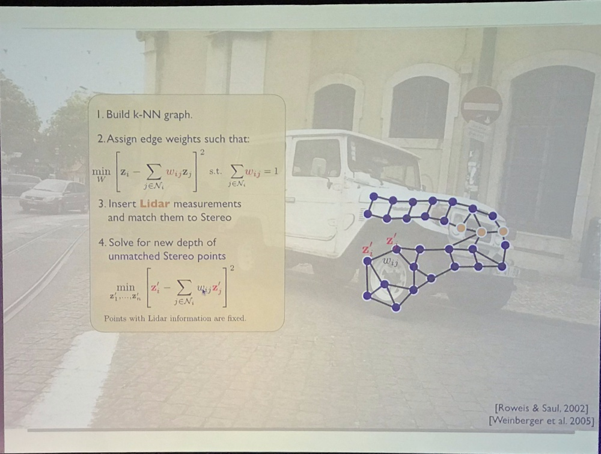

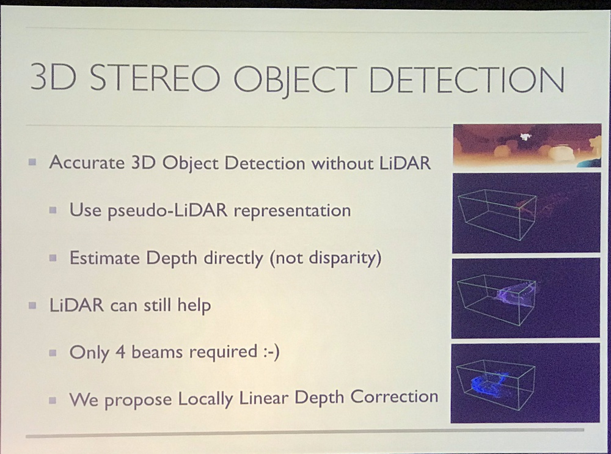

### Alex Kendal@Cambridge+Wayve
- [Nvidia weather in 2016](https://images.nvidia.com/content/tegra/automotive/images/2016/solutions/pdf/end-to-end-dl-using-px.pdf)
- Self driving state representation today
	- 3D object detection
	- semantic segmentation
	- agent prediction
- A good representation
	- 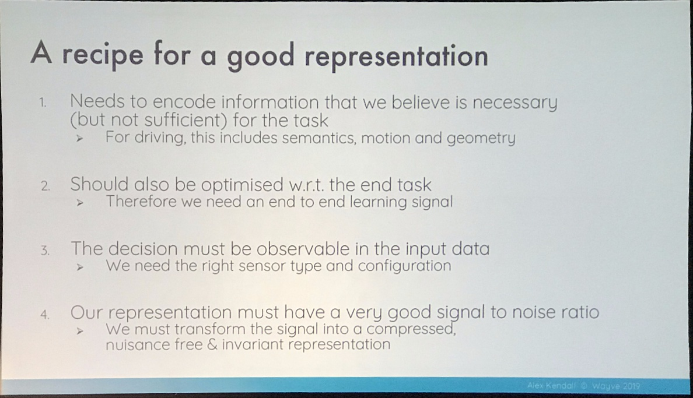
- Driving data is exceptionally biased. Turn log-tail distribution to normal tail distribution
- How to get more human guidance in an exploration setting? --> simulation
- Q: Sim2real problem --> how to learn a proper representation?
	- zero shot sim2real: [Learning to Drive from Simulation without Real World Labels](https://arxiv.org/abs/1812.03823): learn to project to a latent space for domain adaption and control jointly.
- Interpretation/Verification of DL representation
	- [Real Time Image Saliency for Black Box Classifiers](https://arxiv.org/abs/1705.07857)
	- [Interpretable Explanations of Black Boxes by Meaningful Perturbation](https://arxiv.org/abs/1704.03296)
	- **Note** learn to encode state for traffic light from mid-unet layers and 
	- 
- What metric to optimize?
	- We care about minority cases more
- **Note**: Difference with Go and DOTA
	- Games states are easy (discrete, fully observable or noise free), but action space are huge
	- autonomous driving: state space is huge, but action space is simple

### Trevor Darrell@BAIR
- 3D tracking
- occlusion aware 3D tracking
- [Joint Monocular 3D Vehicle Detection and Tracking](https://arxiv.org/abs/1811.10742)
- [Monocular Plan View Networks for Autonomous Driving](https://arxiv.org/abs/1905.06937)
- Explainable/causal driving policies
	- [Interpretable Learning for Self-Driving Cars by Visualizing Causal Attention](https://arxiv.org/abs/1703.10631)
- Localization
	- [Accurate Visual Localization for Automotive Applications](https://arxiv.org/abs/1905.03706)

### Raquel Urtason@Uber ATG
- Redundancy
- Disadvantage of traditional engineering stack
	- hard to propagate uncertainty
	- computation not shared between modules
	- Each module is trained separately to optimize diff objectives
	- 
- Not all actors influence driving behavior
	- Most critical object need to be evaluated separately
	- Multi-sensor fusion: Liang et al, CVPR 2019
	- Xiong et al, CVPR 2019 oral, UPSnet, UPSNet ([A Unified Panoptic Segmentation Network]())
- Joint perception and prediction
	- Luo et al, CVPR2018 oral (prediction of waypoint in the future)
	- IntentNet: [CoRL 2018](http://www.cs.toronto.edu/~wenjie/papers/intentnet_corl18.pdf)
		- stopped vs park
		- 
	- Human showcase their intent, indicator/turn signal detection (ICRA2019)
- Joint Perception/prediction/planning
	- Zheng, oral at CVPR 2019, [End-to-end Interpretable Neural Motion Planner](http://www.cs.toronto.edu/~byang/papers/nmp.pdf)
	- 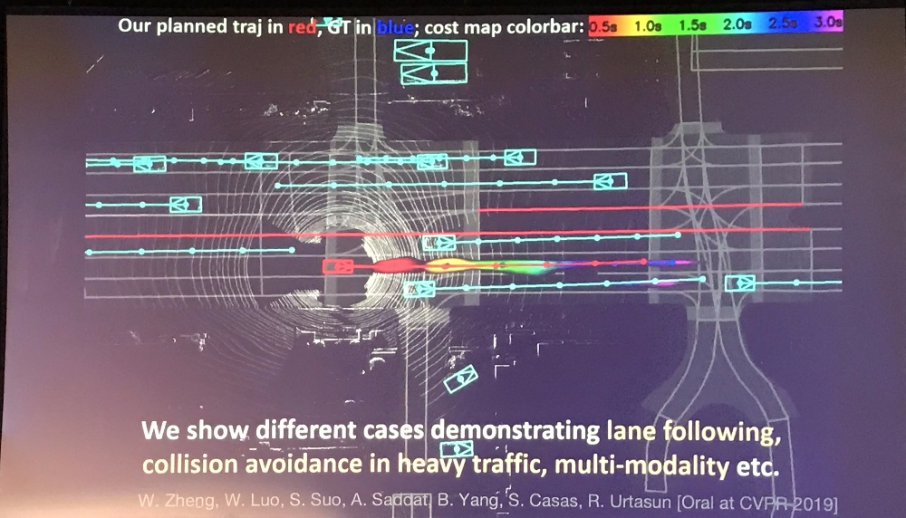
- AI in HD maps
	- Liang et al, CVPR 2019 (Convolutional Recurrent Network for Road Boundary Extractio)
- detection of construction elements
- AI for localization
	- VLAD for image retrieval
- AI for simulation
	- capture the world and simulate sensor input
	- separate static scenes and dynamic objects
	- real lidar and simulated lidar look almost the same

## Perception, Prediction, Data Collection for Autonomous Cars (from Lyft Level 5)
### Luc Vincent@EVP
- 14% of LA is parking!
- 1% of miles are ridesharing
- Lyft Level 5
- Building blocks
	- Robotics platform
	- Perception and prediction
	- Map and localization
	- Motion planning
	- Motion control

### Ashesh Jain@perception
- Perception stacks
	- 
	- 
- Challenges
	- sensor performance degrades with distance
	- Data Labeling errors --> need to be sent back to data labeling team for correction
	- **Notes** sensor synchronization: needed for accurate annotation of MOD, trigger the camera when lidar sweeps through the camera's field of view
	- Not all data are equal
		- Automatically finding similar cases for labeling 
		- Class imbalance
		- Solution: Data Sampler (like data booster), dump to database
		- 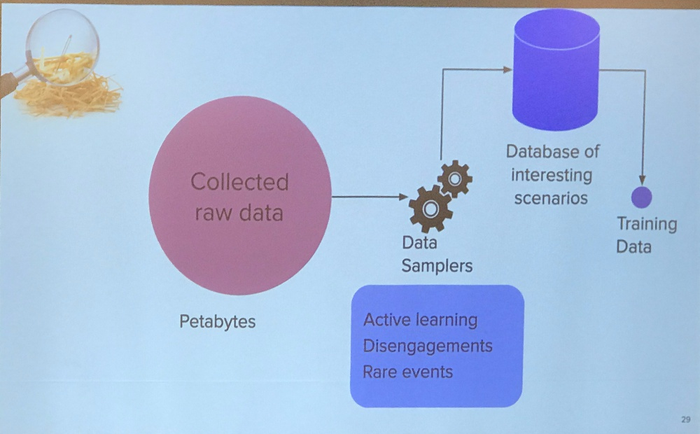
		- Query of data: get images with more than 20 pedestrians
- 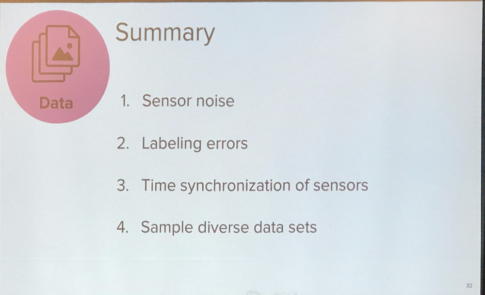
- 2D detection has been democratized
- Point cloud deep learning
- 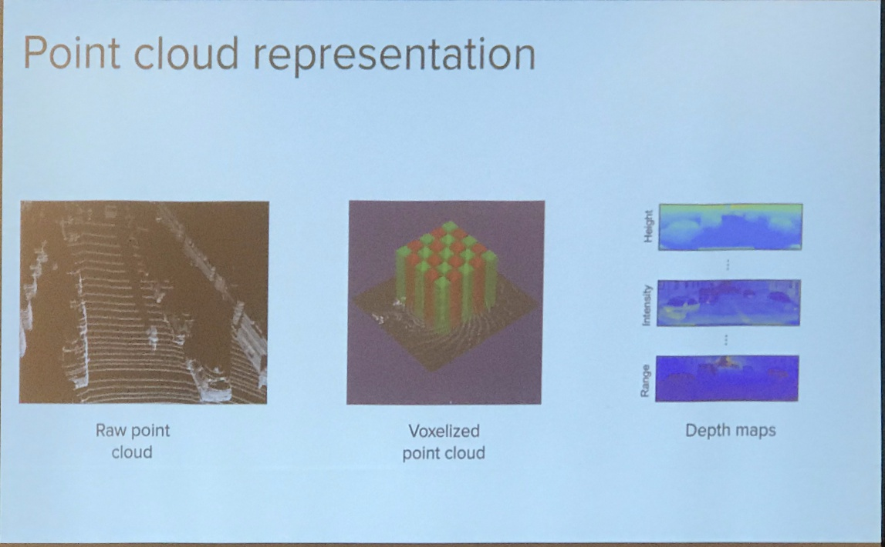
- 
	- Embedding of point cloud (interesting view point, like word2vec for words)
	- Point cloud embedding
		- PointNet does not help with outdoor scenes, global feature embedding works better indoor
		- VoxelNet or PointPillars | Pixor (hand crafted)
		- Multi-task multi sensor fusion from Uber
- Practical
	- unclassified clutter on the road
	- Need class agnostic pipeline
- Perception is not just about Deep Learning
- Modeling uncertainties in neural networks with DL and expert systems in a DAG
- 
- 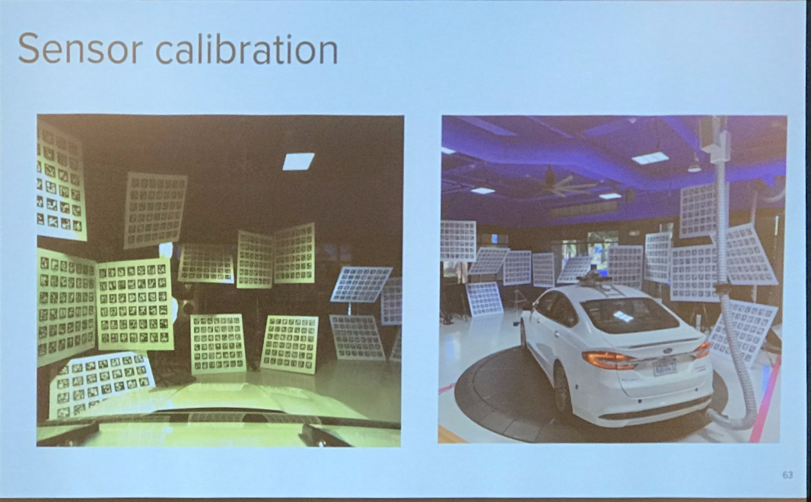

### Sammy Omari@prediction
- Trajectory prediction
	- Lane-graph-based rollout for trajectory hypothesis
- Trajectory scoring (which trajectory is how likely)
- Regress uncertainty and incorporate in loss ([Short-term Motion Prediction of Traffic Actors for Autonomous Driving using Deep Convolutional Networks](https://arxiv.org/pdf/1808.05819.pdf))
- 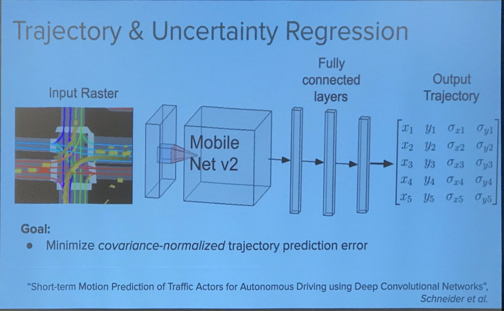
- 
- Is top down raster sufficient for prediction? (IntentNet, ChaufeurNet)
	- Not for humans, pedestrian crossing or people on bikes. ([A data-driven approach for pedestrian intention estimation](https://ieeexplore.ieee.org/document/7795975))
- Again, Data imbalance
	- Lange changes vs others
	- Intersection vs road
	- turning vs straight
- Build cut-in predictor dataset
	- 
	- 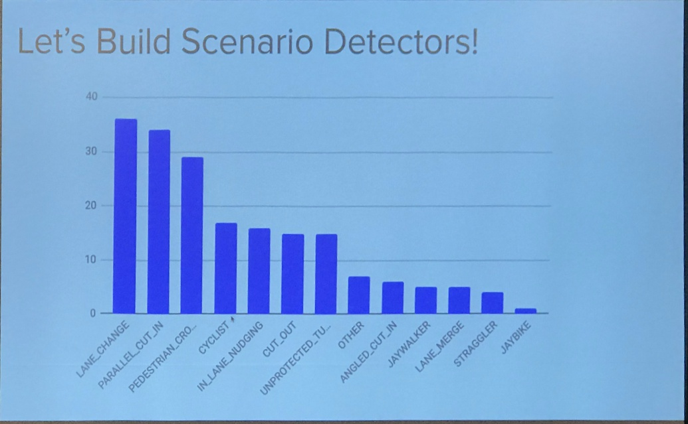
- Highly imbalanced data (most vehicles just follow lanes and follow rules)
- Q: How to detect online the uncertainty and quality of the dl or expert system, and then leave to expert systems

### Peter Ondruska@director of eng
- Long tail of events: easy case quite often

### Uncertainty in DL
#### trajectory forecasting
- Kris Kitani@CMU
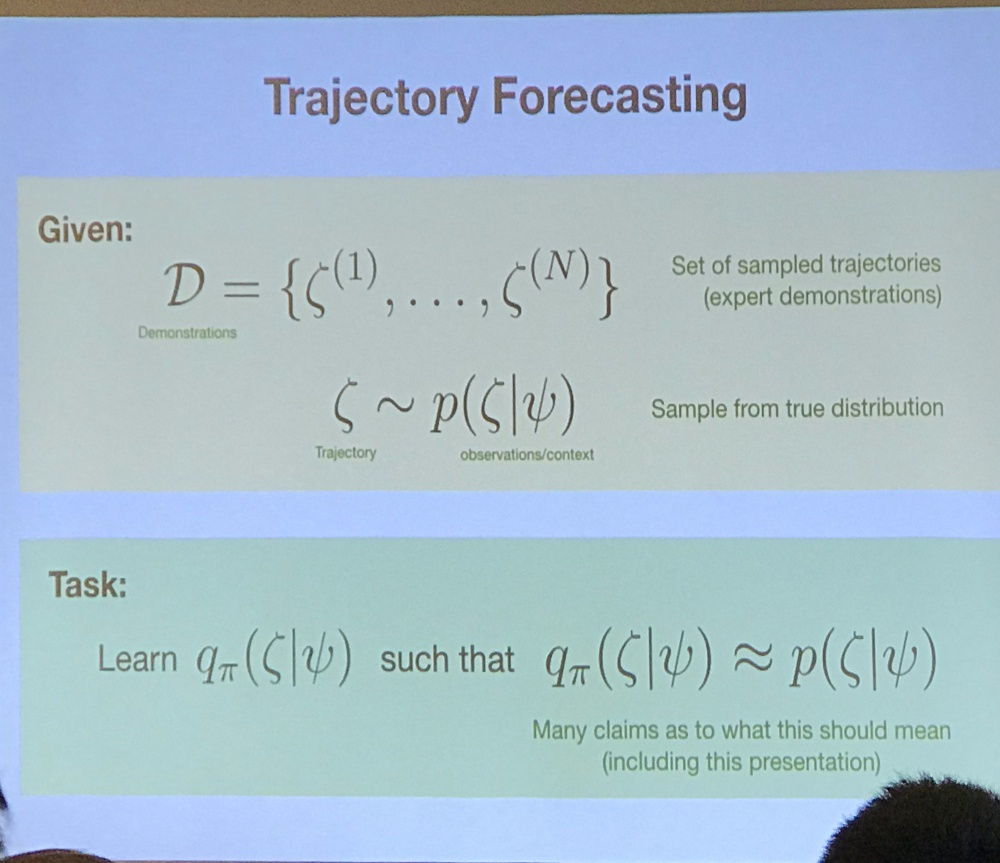
- How to recover **multi-model** from unimodal observation? "I want to know everyting the traffic agent may do" for safety critical systems
- Input: egocentric video
- Output: current pose, third person GT, future pose forecasting
- Very underdetermined
- Immitation learning (behavior cloning) is different from reinforcmenet leanring
- Behavior cloning: min cross entropy
	- forward x-entropy prioritize recall
	- reverse x-entropy prioritize precision
	- [Symmetric cross entropy](http://openaccess.thecvf.com/content_ECCV_2018/papers/Nicholas_Rhinehart_R2P2_A_ReparameteRized_ECCV_2018_paper.pdf)
- How to identify extremely rare cases? We want to sample trajectories that are diverse and likely.
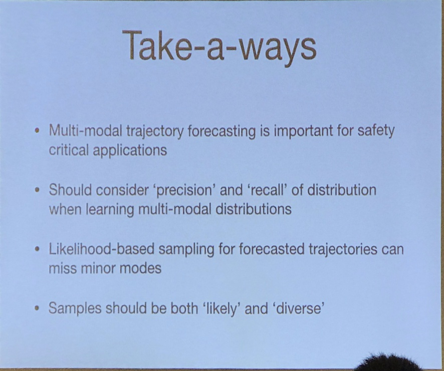

#### Alex Kendall
- Epistemic uncertainty: use MC dropout or ensemble
- Aleatoric uncertainty remain constant while epistemic uncertainty increases for out of data example
- **Note**: Improve epistemic uncertainty is higher priority, can be done offline
- Critical problem: convert the long tail distribution to a uniform distribution