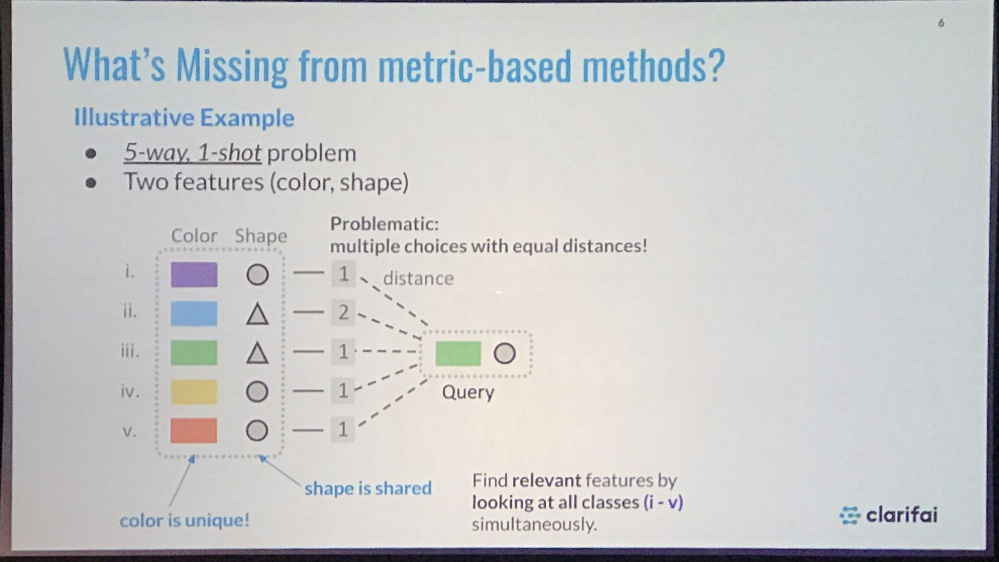
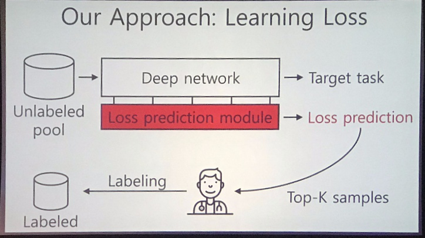
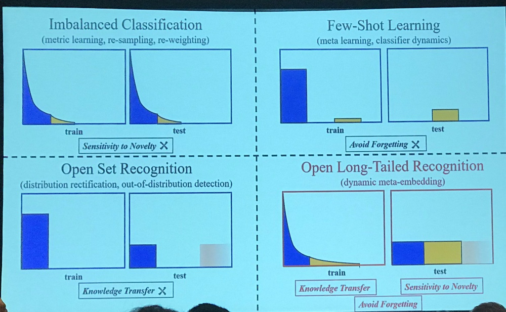

## 06/18/2019 (Tuesday)

#### Few shot learning
- Support set with few labeled sample per class, query set

#### new CNN architecture
- Kerverlutional Neural Network
- Polynomial kernel, gaussian kernel
- Why does ReLU get high confidence (overconfident) far away from the training data

- Neural rejuvenation: force dead neuron to reinitialize
- deep metric learning: contrastive vs triplet learning
- Classification --> dense image prediction
- AUtO-DeepLab: similar to auto FPN

- Learning loss for active learning **Note**

- [Striking the Right Balance with Uncertainty](https://arxiv.org/abs/1901.07590)

### Scenes and Representation
#### domain adaptation
- d-SNE: generalize model from source domain to target domain

- ADVENT: Adversarial Entropy Minimization for Domain Adaptation in Semantic Segmentation
- **Note** Large-Scale Long-Tailed Recognition in an Open World 
	- [Dynamic Few-Shot Visual Learning without Forgetting](https://arxiv.org/abs/1804.09458) (CVPR2018)
	
	
- Towards Scene Understanding: Unsupervised Monocular Depth Estimation With Semantic-Aware Representation:
	- train depth and semantic segmentation to help each other
	- train from different datasets
- Does CNN which perform well on ImageNet generalize well?
	
	