# Workshop

## [Joint Workshop on Long-Term Visual Localization, Visual Odometry and Geometric and Learning-based SLAM](https://www.youtube.com/watch?v=ZCTxPJPCfF0&feature=youtu.be)
- Daniel Cremers
	- [video and slides](http://cvpr20.com/event/keynote-17/)
	- Startup Artisense: cheap senseors (camera, IMU, GPS) to reconstruct the world
	- Erwin Kruppa in 1913: 5 pts solution
	- Keypoint based methods vs direct method
		- How to deploy DL approaches to boost direct SLAM
	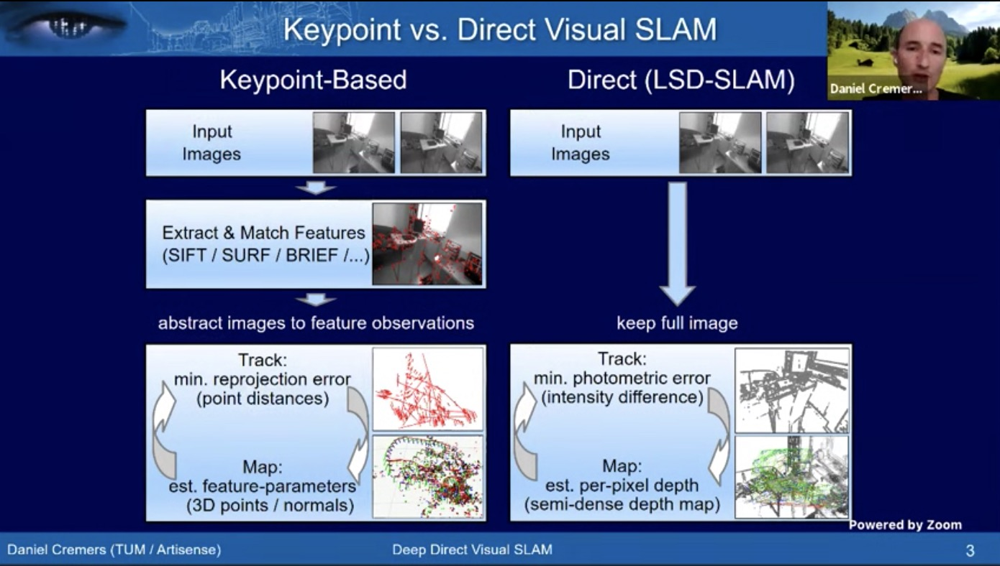
	- LSD SLAM: large scale direct SLAM
		- Pose and 3D alternatingly
		- How to do photometric adjustment simultaneously? --> DSO, as second gen of LSD
	- DSO: Direct Sparse Odometry (1% drift): better than ORB-SLAM
		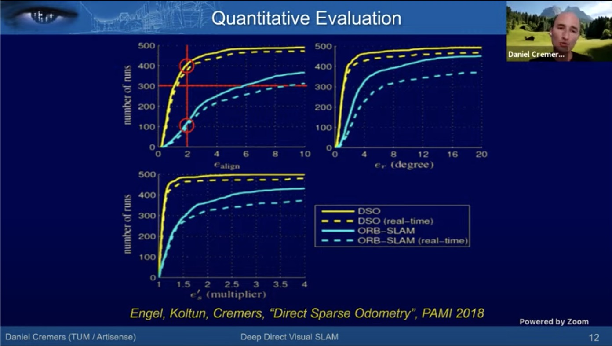
	- DL is not SOTA in early works (2017 and 2018)
	- DVSO (deep virtual stereo odometry) (ECCV 2018), mono DVSO on par with St. DSO. Very little scale drift.
	- [D3VO](https://github.com/patrick-llgc/Learning-Deep-Learning/blob/master/paper_notes/d3vo.md)
	- on par with stereo VIO, much crisper than mono DSO
	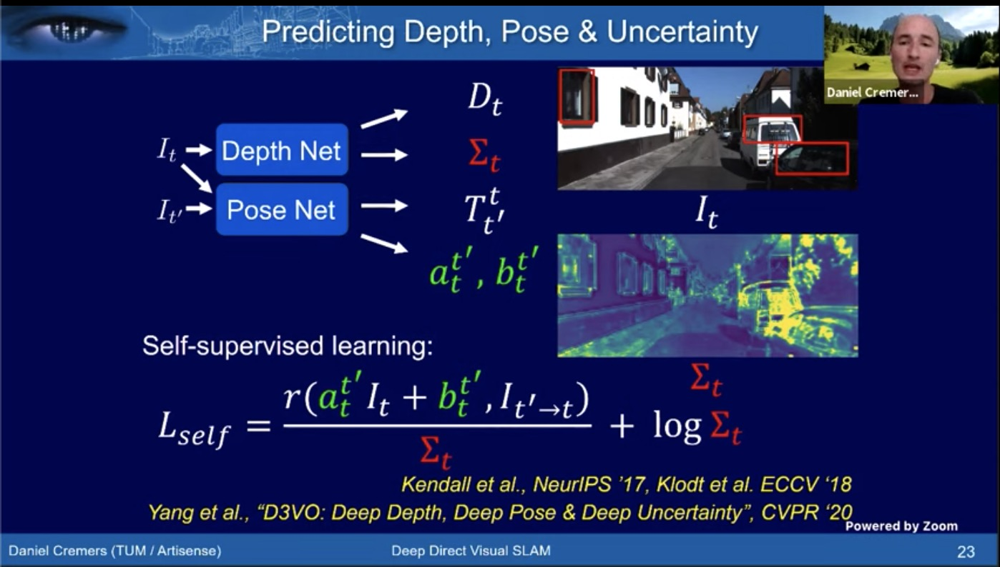
	- [Gasuss Newton Net for multi-weather localization]() ICRA 2020
	- Genealizes quite well. Train on sunny/rainy, and test on sunny/overcast
	
	- Q&A: How to compensate for photo consistency loss when the assumption breaks?
		- predict affine transformation
		- predict a mask where it fails and downweigh
		- predict the changes with nueral network (sunny/rainy)
	- He promotes hybrid approaches
		- Deep learning predicts depth from single image
		- Optimization is powerful and accurate when it is applicable
		- It would be stupid not to use old knowledge
- From SLAM to spatial AI, Andrew Davison
	- Startup SLAMCORE: 
		- robust localization
		- dense mapping
		- semantic undertanding
	- Build semantic maps simultaneously
- Geometric reasoning in Machine vision using only 2D supervision
	- Simon Lucey, Argo
	- Mono image --> CNN --> 3xP + 6 DoF pose
	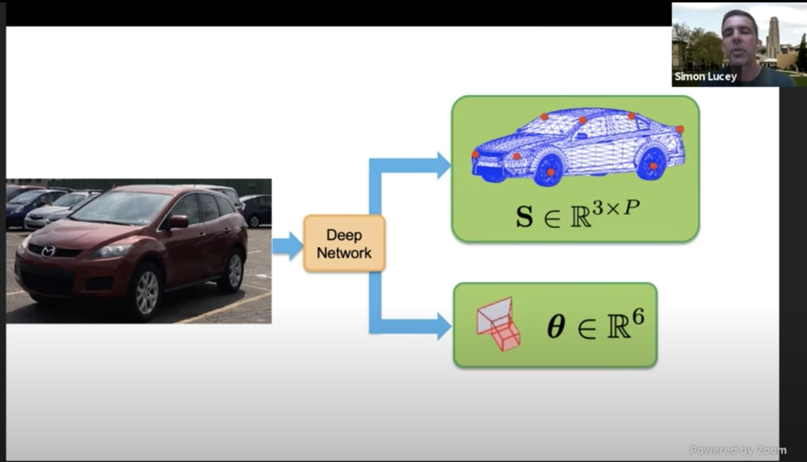
	- Pacal 3D
		- But 3D groundtruth labeling is tedious and difficult (with 3D dictionary)
		- Using simulation will lead to the sim2real gap. 
		- 3D supervision may not capture all the corner cases (limo, etc)
	- Structure from category: lifting chair from 2d to 3d. Much like structure from motion.
	- Just annotate 2D, and 3D structure can be learned inherently.
- Visual slam with deep learning
	- Tomasz Malisiewicz
	- [SuperPoint](https://github.com/patrick-llgc/Learning-Deep-Learning/blob/master/paper_notes/superpoint.md)
		- powerful fully conv design
		- No patches, simultaneous location and descriptor output
		- real time with GPU
		- **No deconv layers, but rather classification** (64+1 dustbin)
		- 15-30 deg rotation during training
	- [Deep ChArUco](https://arxiv.org/abs/1812.03247): detects Charuco patterns in the dark
	- [SuperPoint VO](https://arxiv.org/abs/1812.03245): self improving VO
	- [SuperGlue](https://arxiv.org/abs/1911.11763): get better than motion-guided matching without any motion model.
		- requires both sets of local features; a paradigm shift in matching
		- works better with superpoint and naive matching, in wide baseline matching
	- Quo vadis visual SLAM?
		- multi-user SLAM
		- integrating object recognition into the front end 
- SLAM with plane and objects
	- Sichao Yang, @Facebook, CMU
	- point-based methods 
		- Works well in normal condition (Orb-slam, DSO)
		- too sparse to detect car in driving
		- challenging for low-texture place	
	- Background
		- optimization method: decoupled (regress pose, then detect) and tightly coupled
		- object representation: no shape prior (cuboid, sphere, ellipsoid), weak prior (skeleton) and accurate prior (3D cad)
			- if not 100% sure if the object matches the 3D CAD, it is hard to use silouette loss. We could use shape encoder to adjust the 3D instances. 
		- optimization cost
	- **Single view detection, and multiview for optimization**
		- [CubeSLAM: Monocular 3D Object SLAM](https://arxiv.org/abs/1806.00557)
		- **Tracking with keypoint within object (maybe w/ optical flow)**. Much better than bbox based approach.
		- Fixed object size assumption.
		- For indoor environment looks fabulous. Do not need explicit loop closure to get good performance. 
		- Dense map just reproject the image onto the plane. --> Can we do the same for moving cars?
		- **Dynamic object SLAM**
	
## [Safe Artificial Intelligence for Automated Driving](https://sites.google.com/view/saiad2020/home?authuser=0)
- [conference page with videos and slides](http://cvpr20.com/safe-artificial-intelligence-for-automated-driving/)

## [All About Self-Driving](http://www.allaboutselfdriving.com/)
- Hardware
	- Ultrasound: only one measurement, spherical distance, can use cross-echo to boost performance.
	- microphone: provide early alert to sirens, background noise signature, limited geometry with beam forming
- End to end vs traditional stck
	- Maps/Sensors --> Perception --> Prediction --> Planning --> Control
	- Interpretable intermediate representation
- 3D Perception:
	- Lidar: 
		- 3d voxel: keeps metric space, but large sparsity, and computation grows cubically
		- range view: compact, panorama range for lidar. Efficiently processable by 2D CNN. Hard to incorporate prior knowledge
		- BEV: also sparse, can use 2D conv efficiently
		- point set: preserve point location; harder to learn; irregular memory access and dynamic kernel computation
		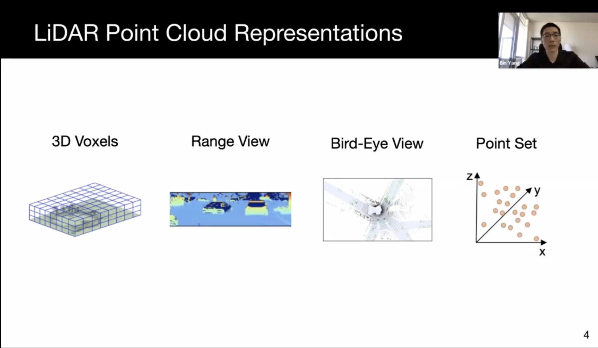
	- Sparse convolution, sparse block convolution; use road map mask and object mask to speed up computation
	- One stage (real time, but less accurate) and two stage
		- PIXOR
	- Mono3D:
		- Lift to 3D at output: unsatisfactory
		- Lift to 3D at input: pseudo-lidar
		- Lift to 3D at feature map: OFT, can work without depth estimation. Reason depth in feature map
	- Fusion lidar/camera
		- Fusion in Cascade: F-pointnet, can be hard for occluded object
		- Fusion at output: safety from redundancy, mono3D + lidar3D
		- Fusion at input: pointpainting, limited exploitation of camera data
		- Fusion at Feature: PointFusion, ContFuse; more robust to small calib errors; more computation cost
	- Radar
	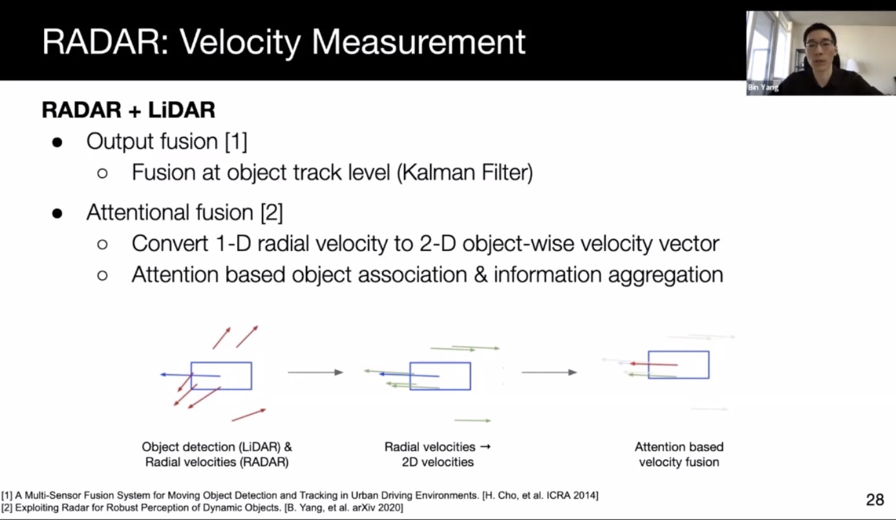
	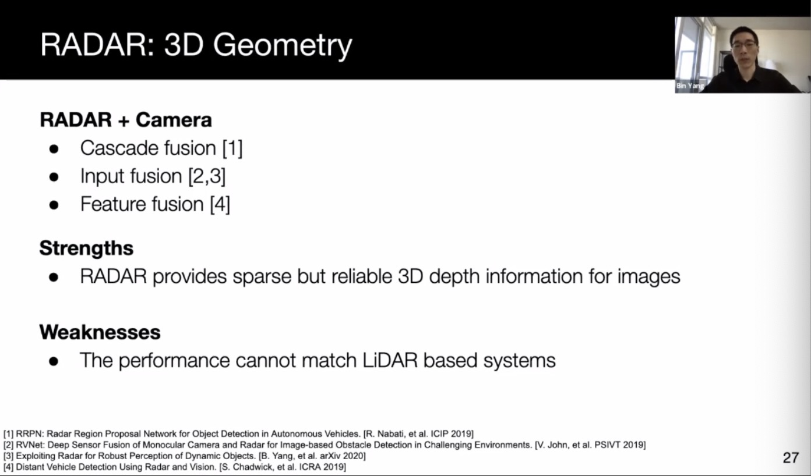
	- HD maps
		- Geometric correction by subtracting ground height
		- raster map (CheuffeurNet)
		- Lane graph (vector net)
	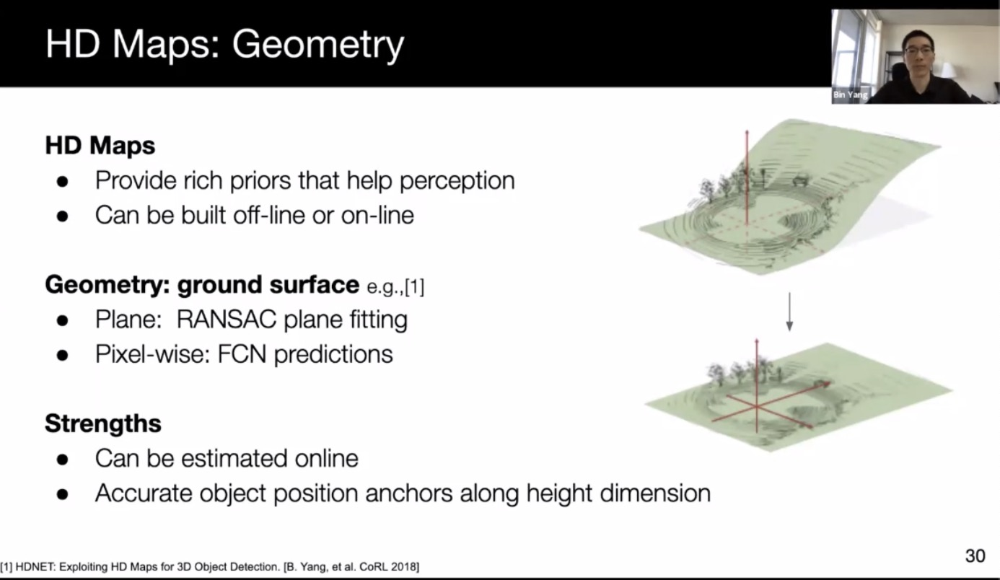
	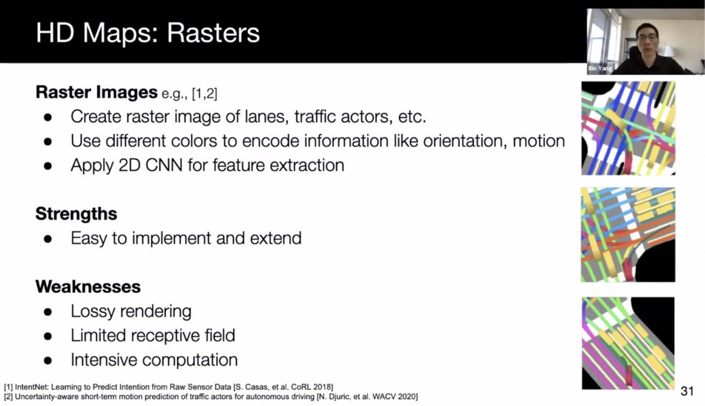
	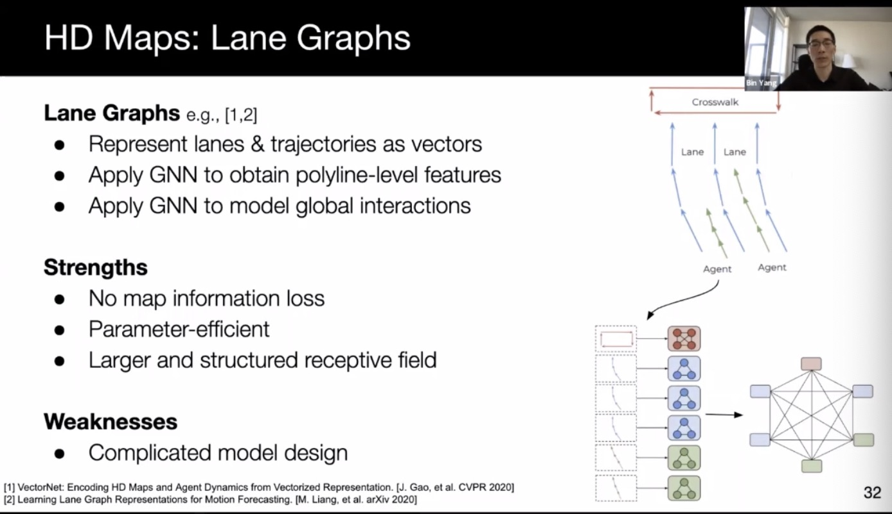
	- Detecting the unknown by projecting to an semantic-agnostic space
	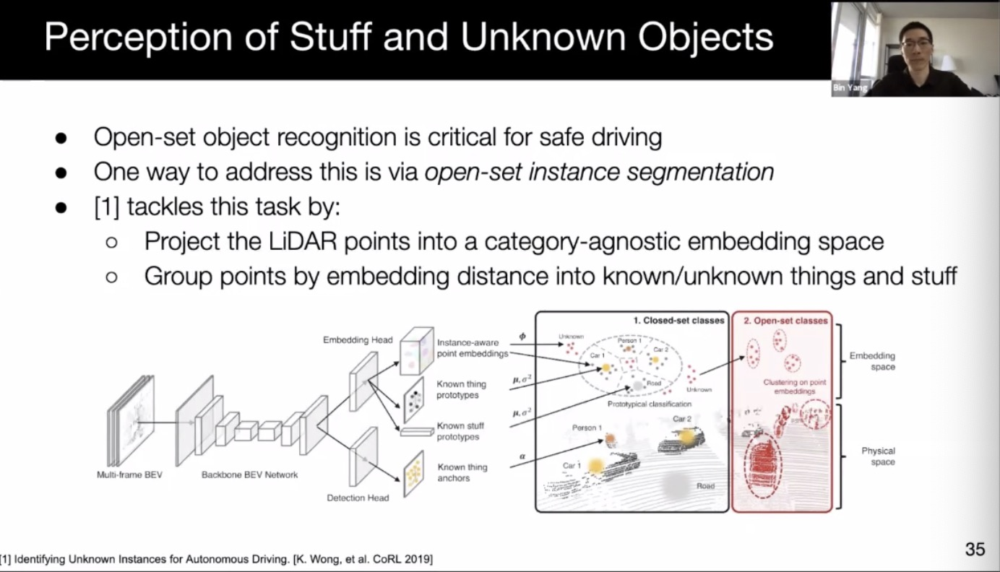
- Prediction
	- tradditional
		- Unroll the tracker's state with a kinematic model (linear motion model, constant turn rate, etc)
		- Maneuver-based, classify first
	- Using neural network for prediction, with HD map
	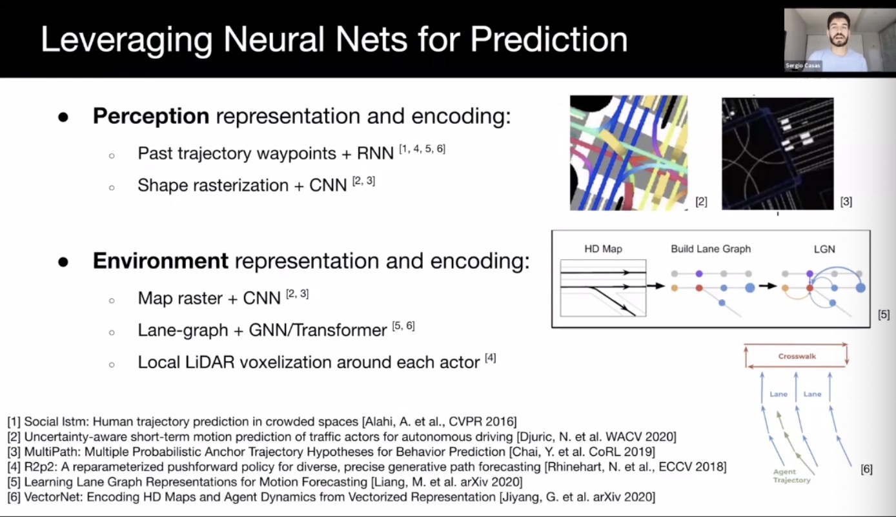
	- Joint perception and prediction
		- [Fast and Furious]()
		- [IntentNet]()
	- Predicting each object individually may lead to collision
	- Using social pooling to extract social vector to model interaction
	- Trajectory uncertainty and multi-modality
	- mixture of Gaussian, occupancy grid, **trajectory sets** (coverNet; seems most promising), Auto-regressive (R2P2, trajectron; slow, compounding error)
	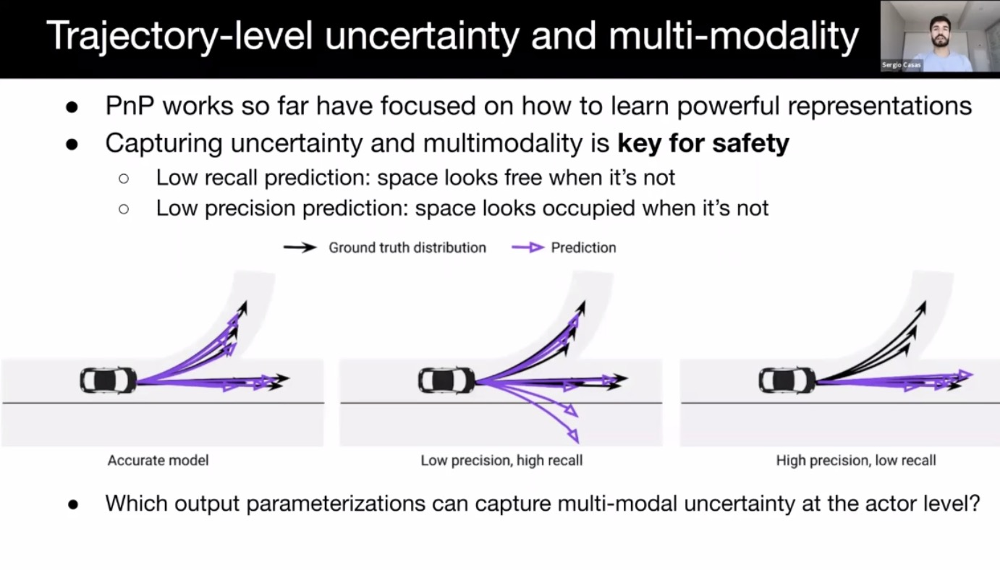
	- Use prior knowledge in precise multimodal prediction; less off road/map behavior
	- Scene-coherent sampling: social auto-regressive methods, using states of other actors when unrolling. Alternatively, ILVM (implicit latent variable model for scene-consistency motion forecasting) can be used for parallel sampling.
	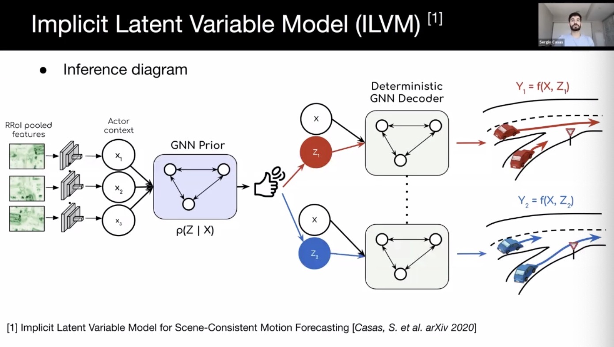
- Motion planning and control
	- Route, behavior, trajectory planning
	- Route planning: A*, Dijkstra algorithm
	- Behavior planning: reduce complexity in trajectory planning
		- State machine: hard to generalize
		- Optimal driving corridor
	
	- Trajectory planning: 
		- Continuous optimization (variable execution time, problematic for safety-critical applications)
		
		- Sampling based methods (suboptimal solution)
	- Control
		- Path following
		- Model predictive control
	- Learned joint planning and control
- Building HD Maps
	- Human annotation is extremely tedious. 
	- Using DL to help automate the process
- Localization within HD Maps
	- GNSS, camera, lidar, IMU, wheel odo
	- topological maps (openstreetmaps)
	- challenges: sensor noise, dynamic objects, degenerate geometry, environment changes (construction site)
	- minimal (3 DoF lat, long, yaw) vs complete 6 DoF
	- Localization as State Space Estimation
	- Bayesian filter: Usually not tractable in practice
		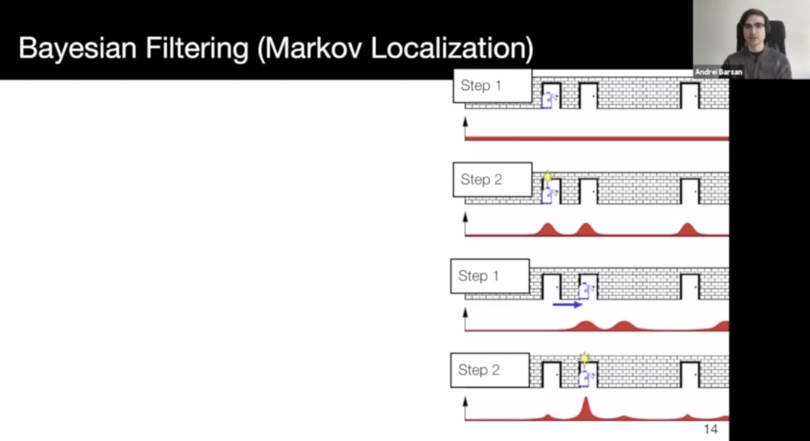
		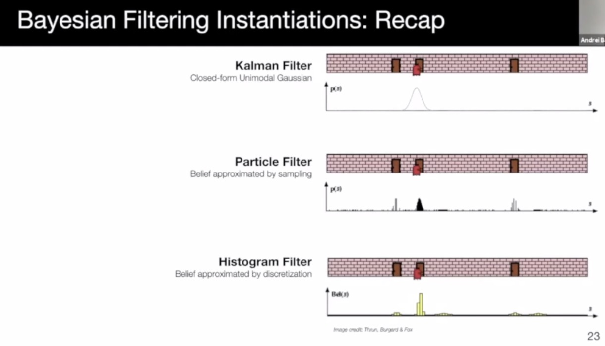
		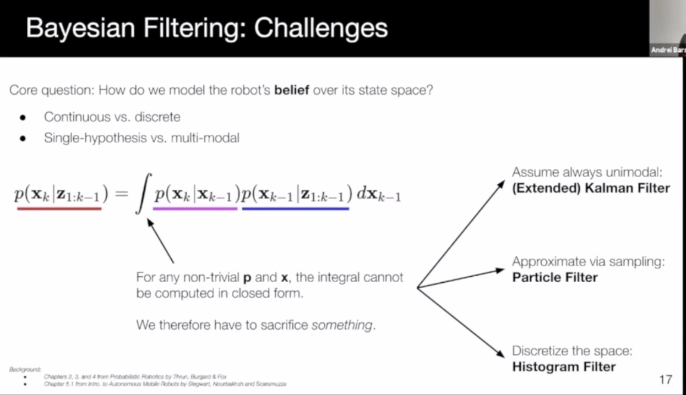
		- Kalman filter: efficient, compact, but gaussian-like and unimodal (single hypothesis tracking)
		- Particle filter: non-parametric, any distribution, supports multi-modal, but may suffer from mode collapse due to insufficient sampling
		- Histogram filter: any distribution, multi-modal, avoids unimodal collapse, but memory intensive
	- Existing methods: (6 methods)
		- RTK: need direct satellite LoS
		- Semantic matching: light weight maps, cannot achieve cm level 
		- geometric alignment: lidar to 3D HD map: need a good initialization; storage of detailed HD Map is expensive; can degenerate in tunnels
		- Camera to lidar matching: map with Lidar, match with camera; cm accuracy;
		- place recognition: image retrieval; not cm level accuracy
		- Lidar reflectance matching: need good initialization; can be robust to outliers, and can be implemented efficiently; vulnerable to lidar mis-calibration
	- Recent methods: 
		- [learn to localize with lidar to HD map matching](http://openaccess.thecvf.com/content_CVPR_2019/papers/Wei_Learning_to_Localize_Through_Compressed_Binary_Maps_CVPR_2019_paper.pdf) (CVPR 2019): main drawback is the large storage space of HD Map. Learn compressed representation with DL. (3 orders of magnitude less space, with marginal degradation in accuracy.)
	- Global localization
		- Initialization, and recovery
		- Challenges: the same place can be different, weather, time of day, season, etc
		- Pose regression/retrieval-based

## [A Comprehensive Tutorial on Video Modeling](https://bryanyzhu.github.io/videomodeling.github.io/)
- Human activity understanding in videos
	- Controlled collection vs In the wild
	- Trimmed and untrimmed: are there irrelavant information in video?
	- Single person vs multi-person
	- **Temporal action detection**: automatic highlight extraction 
		- Input: untrimmed video
		- output: start and end timestamps, and action labels
		- Strongly supervised vs weekly supervised
	- Action segmentation:
		- Similar to temporal detection
		- output: action segmentation per frame. 
	- Online vs offline
	- Modeling longer timespan
		- RNN or 3D CNN: but still intractable to model longer sequence
		- one solution: temporal segment network: model from sparse sampling
		- attention vs graph conv
			- to address regular conv (computation efficiency)
			- non-local CNN
			- ST-GCN (spatial-temporal graph conv networks)
	- Efficiency:
		- pseudo-3D conv
		- Decoupled 3D conv
- Recent SOTA (2014-2020)
	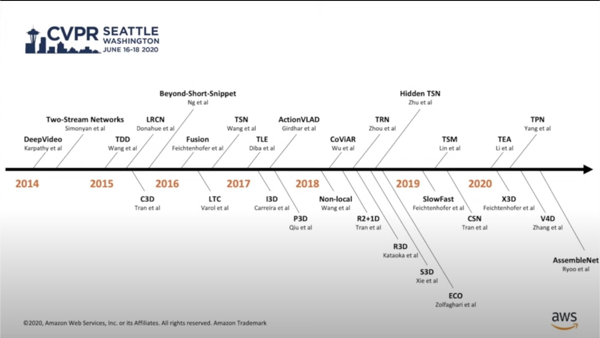
	- DeepVideo by Karpathy: fovea and context streams
	- Two stream methods: spatial stream + temporal stream (single frame + optical flow)
		- But optical flow calculation and loading I/O slows down training and inference
	- 3D CNN
		- C3D
		- I3D (inflating and boostraping)
		- P3D: factorize 3x3x3 into simpler kernels
		- non-local
		- slow-fast (cf. two stream models. slow-fast models two temporal speeds, not spatial and temporal modeling)
		- X3D: improved slimmed slow-fast
	- Other works:
		- Directly inferencing video codec
		- draw inspiration from optical flow, and use CNN to learn optical flow on the side 
		- [TSM: Temporal Shift Module for Efficient Video Understanding](http://openaccess.thecvf.com/content_ICCV_2019/papers/Lin_TSM_Temporal_Shift_Module_for_Efficient_Video_Understanding_ICCV_2019_paper.pdf): temporal shift, suitable for video object detection and edge deployment. 
- Decord: An Efficient Video Reader for Deep Learning
	- Decoding videos to frames
		- takes 10x more space
		- I/O bottleneck
		- Data storage is huge!
	- Random access > sequential read.
	- CPU or GPU loading.
	- pythonic
	- Can be used in many DL frameworks, including pytorch.